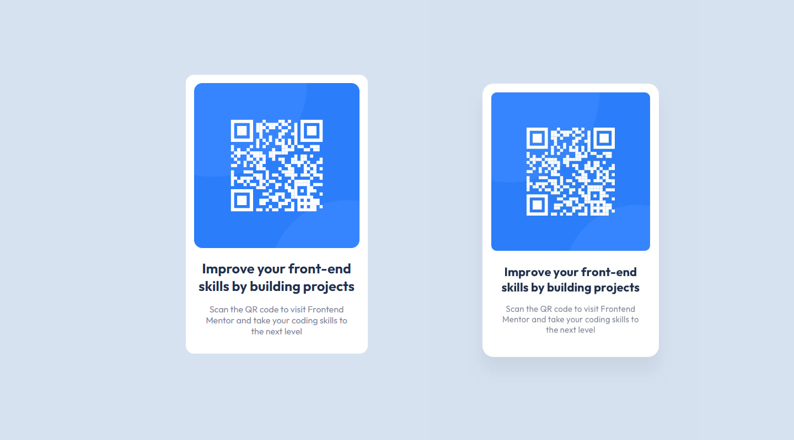

# Frontend Mentor - Product preview card component solution

This is a solution to the [Product preview card component challenge on Frontend Mentor](https://www.frontendmentor.io/challenges/product-preview-card-component-GO7UmttRfa).

## Table of contents

- [Overview](#overview)
  - [Screenshot](#screenshot)
  - [Built with](#built-with)
  - [What I learned](#what-i-learned)
  - [Continued development](#continued-development)
  - [Useful resources](#useful-resources)
- [Author](#author)

## Overview

### Screenshot

Left previews are my project.

Project:

### Built with

-HTML
-CSS

### What I learned

Easy project. Nothing new.

### Continued development

I dont know what should I improve in this project.

### Useful resources

- https://devdocs.io/

## Author

- Website - [purplehazee1337](https://purplehazee1337.github.io/portfolio/home.html)
- Frontend Mentor - [@purplehazee1337](https://www.frontendmentor.io/profile/purplehazee1337)
- Twitter - [@purplehazee1337](https://twitter.com/purplehazee1337)